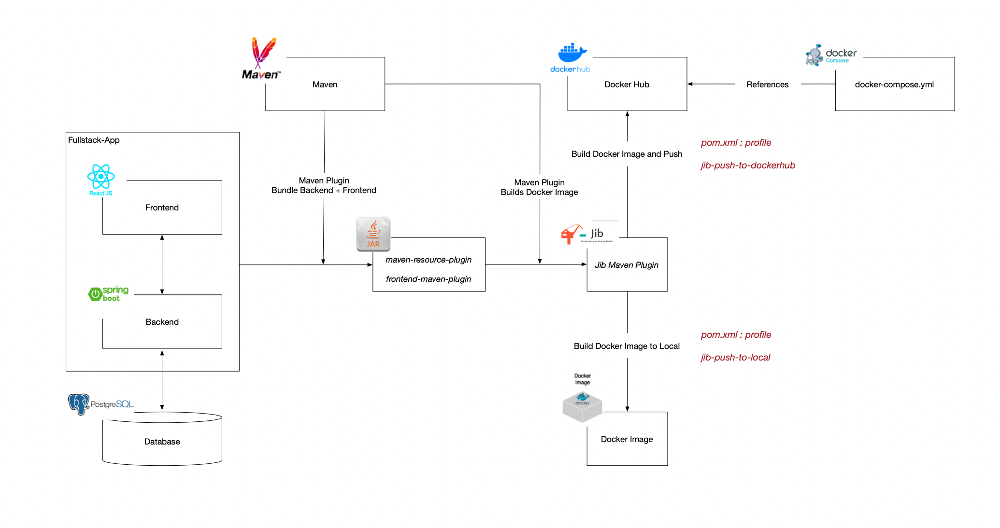

# Project 1: Spring Boot & React Fullstack 

## Description:
A comprehensive project showcasing full-stack development using Spring Boot for backend services and React for frontend development. 
This project emphasizes deployment automation and efficient error handling. 

--- 

## Architecture Diagram:

--- 

## Highlights: 
- Backend API bult with Spring Boot. 
- React.js front end with hooks and function components 
- Robust server-side and client-side error handling. 
- Unit and integration tests for the reliable code. 
- Automated deployment pipelines with GitHub Actions. 
- Deployment monitoring with Slack integration. 

--- 

## Teach Stack: 
- **Spring Boot Backend API**
- **React.js Frontend**
- **Maven Build Tool**
- **PostgreSQL Database**(running on Docker)
- **Spring Data JPA** for adata management

---

## Retrospective:

--- 

## References 
- [Spring Boot & React Course](https://www.amigoscode.com/p/full-stack-spring-boot-react)
- [Spring Boot & React Github Repository](https://github.com/amigoscode/spring-boot-react-fullstack)
- [Ant Design 4.x](https://4x.ant.design/components/overview/)
- [Maven Plugin: frontend-maven-plugin](https://github.com/eirslett/frontend-maven-plugin)
- [Jib](https://github.com/GoogleContainerTools/jib)